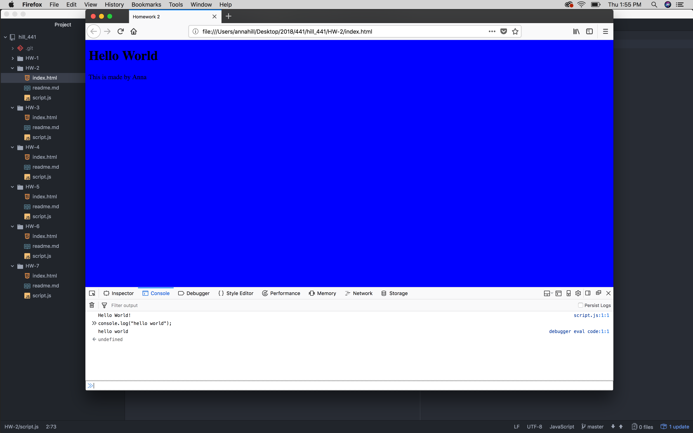

## Week Two, HW-2
## Hill, MART 441

[link to HW-2 Webpage](https://annalhill.github.io/hill_441/HW-2/main.html)

#### Notes:

[MART 341](https://montana-media-arts.github.io/mart341-webDev/) - Use as a reference for HTML and CSS

1. HTML provides the basic structure of sites, which is enhanced and modified by other technologies like CSS and JavaScript.
2. CSS is used to control presentation, formatting, and layout.
3. JavaScript is used to control the behavior of different elements.
4. BASH is what I use in Terminal on OS systems- this will be used and seen throughout this class

- To view the code behind a program, review mistakes, or see how elements interact go,
  - Tools - > Web Developer - > Web Console (Firefox)

As per the first steps of this homework, I believe this screenshot demonstrates that I've done it right?


```
<script> </script>
```

- These tags allow you to write Javascript within your HTML documents
- In the index.html document that I have set up, I am calling in the script.js document and anything that is in it (similar to how we link in CSS documents)
- Otherwise, you could also take the script tags and write your javascript commands directly into the document
s
